这个思路非常清晰，也非常**Pro**。

在 AI 辅助编程（Vibe Coding / Cursor / Windsurf）时代，**"Prompt Engineering" 的本质就是 "Spec Engineering"（规格工程）**。AI 写代码很快，但如果你给的指令模糊，它产出的“垃圾”也很快。

只要你手里握着这两份文档（Workflow + Checklist），你就是**产品经理 + 测试经理**，AI 只是你的**高级实习生**。

以下是为 **Project Maigo (Phase 1 & 2)** 量身定制的 **开发者核对清单** 和 **用户工作流**。

---

# 🗺️ Part 1: 用户工作流 (User Workflows)

这是系统的“叙事线”。所有的代码都必须服务于这几个故事。

### 1.1 "The Seeker" Flow (迷茫学生：寻找答案)

```mermaid
graph TD
    Start((用户访问)) --> A[首页 Landing]
    A --> B{是否已设置状态?}
    
    B -- No --> C[迷雾引导 (The Fog Modal)]
    C -->|选择身份: 大一/双非/迷茫| D[写入 LocalStorage]
    D --> E[侧边栏重新渲染 (解锁/高亮路径)]
    
    B -- Yes --> E
    
    E --> F[阅读攻略文章]
    F --> G{遇到外部资源?}
    
    G -- Yes --> H[查看 Reference Card]
    H -->|点击| I[跳转外部原链接]
    
    F --> J{想要吐槽/提问?}
    J --> K[选中段落 (Selection)]
    K --> L[弹出评论框 (Hash-based)]
    L --> M{已登录?}
    
    M -- No --> N[GitHub OAuth 登录]
    N --> O[发布评论]
    M -- Yes --> O

```

### 1.2 "The Curator" Flow (策展人：贡献内容)

这是社区活力的来源。不管是你，还是未来的贡献者，都遵循此流程。

```mermaid
sequenceDiagram
    participant Contributor as 贡献者
    participant Git as GitHub Repo
    participant CI as Vercel/GitHub Actions
    participant Live as 线上环境

    Contributor->>Git: Fork & Clone
    Contributor->>Git: 创建新文件 src/content/docs/xxx.md
    Note right of Contributor: 填写 Frontmatter (tags, ref-card)
    Contributor->>Git: 提交 PR (Pull Request)
    
    rect rgb(20, 20, 20)
        Note over Git, CI: 自动化防线
        Git->>CI: 触发 Checks
        CI->>CI: Biome Lint (格式检查)
        CI->>CI: Lychee (死链检测)
        CI->>CI: Astro Build (构建检测)
    end
    
    CI-->>Git: Checks Passed ✅
    Contributor->>Live: Vercel Preview 生成
    Git->>Git: Maintainer Merge PR
    Git->>Live: 自动部署上线

```



---

# ✅ Part 2: 功能核对清单 (Functional Checklist)

把这份清单扔给 AI，告诉它：“实现这些功能，直到我能在这个框里打钩。”

### 🛠️ 核心架构与基础设施 (Infrastructure)

* [ ] **构建流水线**: `bun run build` 在本地和 Vercel 上均无报错。
* [ ] **Lint 规范**: `bun run lint` 能正确检查出代码风格问题。
* [ ] **死链检测**: 能够运行链接检查脚本，并报告 markdown 中的 404 链接。
* [ ] **路径别名**: 代码中可以使用 `@/components` 或 `@/assets` 引用文件，无需 `../../`。
* [ ] **SEO 基础**: 只要 Markdown 填写了 `title` 和 `desc`，构建出的 HTML `<meta>` 标签必须正确生成。

### 🧩 策展组件 (Curation Engine - Phase 1 重点)

* [ ] **Reference Card UI**:
* [ ] 显示原文章/视频标题。
* [ ] 显示原作者（Author）。
* [ ] 显示来源平台图标（知乎/B站/GitHub/Medium）。
* [ ] **Maigo 点评区**: 必须有显眼的背景色区别，展示“为什么推荐这个资源”。
* [ ] 响应式设计：在手机上卡片不能溢出。


* [ ] **External Link Tracking** (可选): 点击外链时，最好能触发一个简单的 Analytics 事件（统计哪些资源最受欢迎）。

### 🌫️ 迷雾系统 (The Fog - 状态管理)

* [ ] **Onboarding Modal**:
* [ ] 首次访问强制（或柔性）弹出。
* [ ] 包含 3 个维度选择：年级（Grade）、学校层级（Tier）、目标（Goal）。


* [ ] **状态存储**:
* [ ] 选择后，数据持久化存储在 `localStorage` 中。
* [ ] 刷新页面，Modal 不再弹出，且状态保留。


* [ ] **Store 绑定**:
* [ ] 使用 Nano Stores 在 Astro 组件和 React 组件间共享用户状态。


* [ ] **动态侧边栏**:
* [ ] (高级) 侧边栏能根据用户状态给某些条目加锁（🔒）或高亮（✨）。


### 💬 评论与交互 (Interaction - 最硬的骨头)

* [ ] **Hash 生成**:
* [ ] 每一段落 `<p>` 在构建时自动生成 `id="h-xxxxxx"`。
* [ ] 修改段落文字后，ID **必须**发生变化（验证 Hash 算法生效）。


* [ ] **评论浮层**:
* [ ] 鼠标选中文字或 Hover 段落时，显示评论按钮。
* [ ] 点击按钮，右侧抽屉（Drawer）滑出，而不是覆盖内容。


* [ ] **Supabase Auth**:
* [ ] 点击“登录”能唤起 GitHub OAuth。
* [ ] 登录后，Local Storage 或 Cookie 中能获取到 Session。
* [ ] 刷新页面登录态不丢失。


* [ ] **数据读写**:
* [ ] 能够成功发表一条评论，写入 Supabase 表。
* [ ] 评论必须包含 `block_hash` 字段。
* [ ] 再次刷新页面，在该段落旁能看到评论计数。


### 📱 移动端适配 (Mobile Experience)

* [ ] **汉堡菜单**: Starlight 原生菜单工作正常。
* [ ] **阅读体验**: 表格（Table）在手机上可以横向滚动，不撑破布局。
* [ ] **评论交互**: 手机上不做“划线评论”，改为“点击段落号”或底部的“段落评论模式”。

---

# 📜 Part 3: 给 AI 的开发者准则 (Developer Rules)

在让 Vibe Coding 开始工作前，把这段话作为 **System Prompt** 的一部分发给它。

> **Project Maigo Developer Guidelines**
> 1. **File Structure is Law**:
> * Components go in `src/components/{FeatureName}/`.
> * Content goes in `src/content/docs/`.
> * State logic goes in `src/stores/`.
> 
> 
> 2. **Type Safety**: Never use `any`. Always define interfaces for Props and Database Rows.
> 3. **Styling**: Use Tailwind Utility classes first. Only use `custom.css` for global theme variables.
> 4. **Data Fetching**:
> * Static content (Reference Cards) -> Build time (Astro/Content Collections).
> * Dynamic content (Comments) -> Client side (React + Supabase).
> 
> 
> 5. **Simplicity**: If you have to install a heavy npm package to solve a small problem, **STOP and ASK**.
> 
> 

---

**下一步建议：**
你可以直接把这两份文档保存到你的 Notion 或者仓库的 `docs/specs.md` 中。

当你准备好后，我们就可以根据清单里的 **"Curation Engine (Reference Card)"** 开始 Phase 1 的第一行代码了。是否开始？
